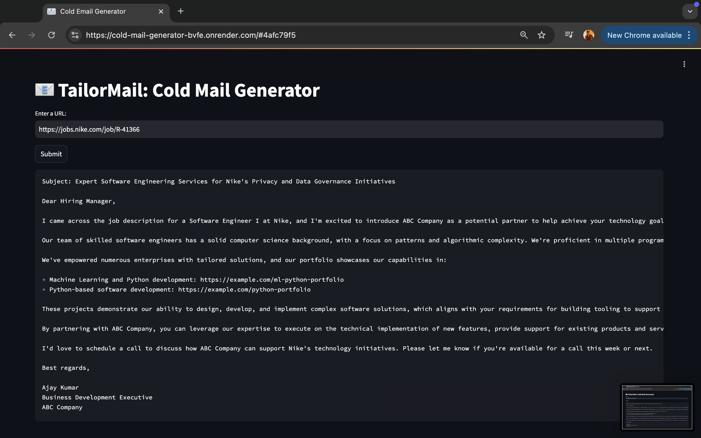

# 📧 TailorMail: Cold Mail Generator

Cold email generator for services company using sambanova.ai, chromadb (vector db), langchain and streamlit. It allows users to input the URL of a company's careers page. The tool then extracts job listings from that page and generates personalized cold emails. These emails include relevant portfolio links sourced from a vector database, based on the specific job descriptions. 

**Imagine a scenario:**

- Nike needs a Principal Software Engineer and is spending time and resources in the hiring process, on boarding, training etc
- ABC is Software Development Company can provide a dedicated software development engineer to Nike. So, the business development executive (Ajay Kumar) from ABC Company is going to reach out to Nike via a cold email.



## Architecture Diagram


## Set-up
1. To get started we first need to get an API_KEY from here: https://cloud.sambanova.ai/apis. Create (touch) `.env` and inside it update the value of `OPENAI_API_KEY={sambanova_ai_api_key}` with the API_KEY you created. 


2. To get started, first install the dependencies using:
    ```commandline
     pip install -r requirements.txt
    ```
   
3. Run the streamlit app:
   ```commandline
   streamlit run main.py
   ```
